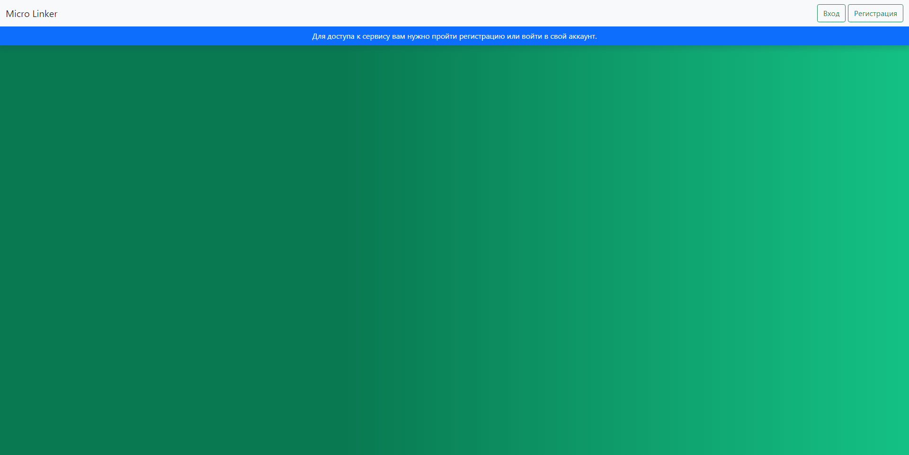

## [Cервис сокращения ссылок](https://micro-linker.herokuapp.com/)
____



____
#### Доступные переменные окружения:
- `DEBUG` — дебаг-режим. По умолчанию `False`.
- `SECRET_KEY` — секретный ключ Django.
- `DB_HOST` — адрес БД.
- `DB_NAME` — название БД.
- `DB_USER` — имя пользователя в БД.
- `DB_PASSWORD` — пароль пользователя.
- `EMAIL_HOST` - хост SMTP сервера.
- `EMAIL_HOST_USER` - имя пользователя SMTP сервера.
- `EMAIL_HOST_PASSWORD` - пароль пользователя SMTP сервера.
#### Запуск Celery
```celery -A config worker -l info``` `-P solo`\
```celery -A config beat -l info```
## Зависимости
Основной файл зависимостей `pyproject.toml`. \
Файл для деплоя `requirements.txt` лежит в ветке `deploy`. \
Сервис развёртнут на [**Heroku**](https://www.heroku.com/) с использование СУБД PostgreSQL.
## Список задач
- [X] Основной функционал сервиса.
- [X] Аутентификация по Email.
- [X] Подтверждение Email.
- [X] Сброс\Изменение пароля.
- [X] Профиль пользователя.
- [X] Celery.
- [ ] Показ рекламы на странице редиректа.
- [ ] REST API.
- [ ] Docker
- [ ] Google OAuth 2.0
## Цель проекта

Код написан в учебных целях.